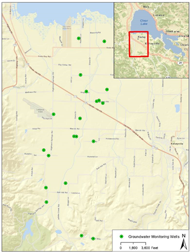

```{r, include = FALSE}
knitr::opts_chunk$set(
  collapse = TRUE,
  comment = "#>", 
  echo = FALSE, 
  message = FALSE,
  warning = FALSE
)
```

```{r setup}
library(adobeCreekData)
library(leaflet)
library(tidyverse)
library(lubridate)

sites_near_adobe <- c("389535N1228968W001", "389569N1228885W001", "389592N1228971W001", 
                      "389726N1228847W001", "389797N1228831W001", "389796N1228819W002", 
                      "389778N1228732W001", "389868N1228802W001", "389930N1228687W001", 
                      "389940N1228706W001", "389937N1228718W001", "389937N1228751W001", 
                      "389975N1228770W001", "390041N1228801W001", "390149N1228719W001", 
                      "390175N1228682W001")
```

# Introduction 

This short article describes the groundwater site codes for the Adobe Creek Groundwater Project. 

## All Sites within the Big Valley Subasin

The data used is a result from making a query for all groundwater sites within the 
the Big Valley Subasin on the CASGEM data portal.

```{r}
groundwater_stations %>% 
  leaflet() %>% 
  addProviderTiles(providers$OpenTopoMap) %>% 
  addCircleMarkers(
    color = "black", weight = 2,
    fillColor = "#2b83ba", fillOpacity = .8, 
    popup = ~site_code
  ) 
```

```{r}
total_stations <- groundwater_stations %>% nrow()
earliest_recording <- groundwater_stations$start_date %>% min()
latest_recording <- groundwater_stations$end_date %>% max()
most_abundant_years <- groundwater_levels %>% 
  group_by(year = year(measurement_date)) %>%
  summarise(total = n())

most_abundant_months <- groundwater_levels %>% 
  group_by(month = factor(month.abb[month(measurement_date)], levels = month.abb)) %>% 
  summarise(
    prop = n()/nrow(groundwater_levels), 
    avg_value = mean(wse), 
    med_value = median(wse)
  )
  
```

In total there are `r total_stations` sites in the Big Valley basin. The earliest recorded data
is from `r format(earliest_recording, "%B %d, %Y")`, and the most recent recording is from 
`r format(latest_recording, "%B %d, %Y")`. The most abundant years of data are:

<br>

```{r}
most_abundant_years %>% 
  ggplot(aes(year, total)) + 
  geom_col(color="white") + 
  scale_x_continuous(breaks = seq(1950, 2019, by = 5)) + 
  labs(title = "Total Observations per year", x = "", y = "Total")
```

Measurements of groundwater elevations is done twice a year, once in the Spring and 
once in the Fall. However Spring and Fall are not a consitent month. The plot below shows
how the data observations are distributed across the months. I present the data as
proportions (for example October accounts for over 30% of all the data we have).


```{r}
most_abundant_months %>% 
  ggplot(aes(month, prop)) + geom_col() + 
  labs(title = "Abundance of Data by Month (proportions)", 
       x = "", y = "Proportion")
```

## Sites Along Adobe Creek 

For this project we are interested in sites along the creek. The image below shows these sites.



Here are the identified sites from CASGEM that are near the Adobe Creek.

```{r}
groundwater_stations_near_adobe <- 
  groundwater_stations %>% 
  filter(site_code %in% sites_near_adobe)

groundwater_levels_near_adobe <- 
  groundwater_levels %>% 
  filter(site_code %in% sites_near_adobe)

groundwater_stations_near_adobe %>% 
  leaflet() %>% 
  addProviderTiles(providers$OpenTopoMap) %>% 
  addCircleMarkers(
    color = "black", weight = 2,
    fillColor = "#2b83ba", fillOpacity = .8, 
    popup = ~paste0(
      "Site Code <b>", site_code, "</b><br>", 
      "Start Date: <b>", format(start_date, "%b %d, %Y"), "</b><br>",
      "End Date: <b>", format(end_date, "%b %d, %Y"), "</b><br>", 
      "Total Observations: <b>", total_measures, "</b><br>", 
      "Total Depth: <b>", total_depth_ft, " (feet)</b><br>"
    )
  ) 
```


```{r}
total_stations_near_abobe <- groundwater_stations_near_adobe %>% nrow()
earliest_recording_near_abobe <- groundwater_stations_near_adobe$start_date %>% min()
latest_recording_near_abobe <- groundwater_stations_near_adobe$end_date %>% max()
most_abundant_years_near_abobe <- groundwater_levels_near_adobe %>% 
  group_by(year = year(measurement_date)) %>%
  summarise(total = n())

most_abundant_months_near_abobe <- groundwater_levels_near_adobe %>% 
  group_by(month = factor(month.abb[month(measurement_date)], levels = month.abb)) %>% 
  summarise(
    prop = n()/nrow(groundwater_levels_near_adobe), 
    avg_value = mean(wse), 
    med_value = median(wse)
  )
  
```

In total there are `r total_stations_near_abobe` sites in the Big Valley basin. The earliest recorded data
is from `r format(earliest_recording_near_abobe, "%B %d, %Y")`, and the most recent recording is from 
`r format(latest_recording_near_abobe, "%B %d, %Y")`. The most abundant years of data are:

<br>

```{r}
most_abundant_years_near_abobe %>% 
  ggplot(aes(year, total)) + 
  geom_col(color="white") + 
  scale_x_continuous(breaks = seq(1950, 2019, by = 5)) + 
  labs(title = "Total Observations per year", x = "", y = "Total")
```

Measurements of groundwater elevations is done twice a year, once in the Spring and 
once in the Fall. However Spring and Fall are not a consitent month. The plot below shows
how the data observations are distributed across the months. I present the data as
proportions (for example October accounts for over 30% of all the data we have).


```{r}
most_abundant_months_near_abobe %>% 
  ggplot(aes(month, prop)) + geom_col() + 
  labs(title = "Abundance of Data by Month (proportions)", 
       x = "", y = "Proportion")
```


